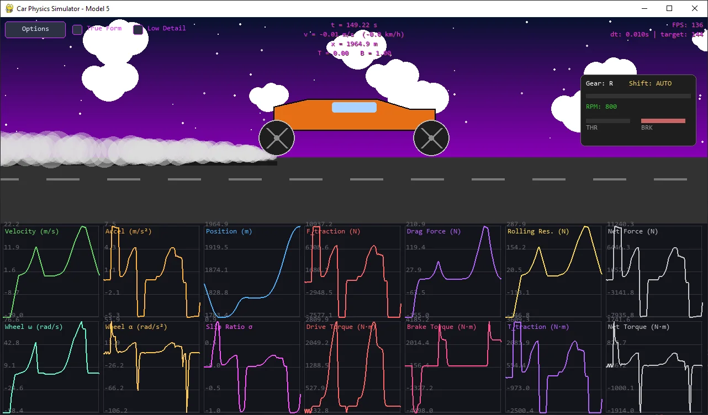

# Longitudinal Car Physics

Main reference: [Macro Monster's Car Physics Guide](https://www.asawicki.info/Mirror/Car%20Physics%20for%20Games/Car%20Physics%20for%20Games.html)

Check out the learning journey on my blog: [yuk068.github.io](https://yuk068.github.io/)

I will make a new repo for model 6-8, link will be updated **here**

I try to break down each model both mathematically (continuous math) and implement them in code.

## Roadmap

```
- [x] Model 1: Longitudinal Point Mass (1D)
    - Straight Line Physics
    - Magic Constants
    - Braking
- [x] Model 2: Load Transfer Without Traction Limits (1D)
    - Weight Transfer
- [x] Model 3: Engine Torque + Gearing without Slip (1D)
    - Engine Force
    - Gear Ratios
    - Drive Wheel Acceleration (simplified)
- [x] Model 4: Wheel Rotational Dynamics (1D)
    - Drive Wheel Acceleration (full)
- [x] Model 5: Slip Ratio + Traction Curve (1D)
    - Slip Ratio & Traction Force
- [ ] Model 6: Low-Speed Kinematic Turning (2D)
    - Curves (low speed)
- [ ] Model 7: High-Speed Lateral Tire Model (2D)
    - High Speed Turning
- [ ] Model 8: Full Coupled Tire Model (2D)
```

Completed models:

- [Model 1: Longitudinal Point Mass (1D)](#model-1-longitudinal-point-mass-1d)
- [Model 2: Load Transfer Without Traction Limits (1D)](#model-2-load-transfer-without-traction-limits-1d)
- [Model 3: Engine Torque + Gearing without Slip (1D)](#model-3-engine-torque--gearing-without-slip-1d)
- [Model 4: Wheel Rotational Dynamics (1D)](#model-4-wheel-rotational-dynamics-1d)
- [Model 5: Slip Ratio + Traction Curve (1D)](#model-5-slip-ratio--traction-curve-1d)
- [Model 6: Low-Speed Kinematic Turning (2D)]
- [Model 7: High-Speed Lateral Tire Model (2D)]
- [Model 8: Full Coupled Tire Model (2D)]

## Showcase

### Model 1: Longitudinal Point Mass (1D)

[Technical Breakdown](https://yuk068.github.io/2026/03/03/car-physics-model1)


**Controls**

- **Space** – analog throttle (ramps 0 → 1 over 1s, adjustable)
- **F** – binary brake
- **Xbox Controller (optional)**
  - **RT** – throttle
  - **LT** – brake

**Interface**

- Side-view road with infinite scrolling environment
- Meter markers every **25 m**
- Car remains centered while the world scrolls
- **Live dashboard graphs** (30-second rolling window)

**Graph Modes**

- **Full mode:** velocity, acceleration, position, engine force, drag, rolling resistance, braking
- **Combined mode:** user-selectable normalized plots (0–1 scale)

**Options**

- Adjustable **physics timestep** (1 ms → 100 ms)
- Adjustable **render FPS** (60 → 240, simulation unaffected)
- **Control scheme selection**
- **Reset Scenario panel** to modify physical constants and restart the simulation

**Key constraint:** the car cannot move backward in this model.

**Entry**

```bash
python model1/simulator.py
```

### Model 2: Load Transfer Without Traction Limits (1D)

[Technical Breakdown](https://yuk068.github.io/2026/03/12/car-physics-model2)


**Controls**

- Changed to seamless detect.

**Entry**

```bash
python model2/simulator.py
```

### Model 3: Engine Torque + Gearing without Slip (1D)

[Technical Breakdown](https://yuk068.github.io/2026/03/15/car-physics-model3)


First model in the roadmap with a proper transmission engine.

**Controls**

- **Keyboard Layout**

| Key | Action | Behavior |
| :--- | :--- | :--- |
| **W** | Throttle | **Simulated Analog:** 0 to 1 (1s ramp-up) |
| **Space** | Brake | **Simulated Analog:** 0 to 1 (1s ramp-up) |
| **A** | Gear Down | Digital / Instant |
| **D** | Gear Up | Digital / Instant |
| **Esc** | Options | Opens Menu |

- **Xbox Controller Layout**

| Control | Action | Behavior |
| :--- | :--- | :--- |
| **RT** (Right Trigger) | Throttle | **Native Analog:** 0.0 to 1.0 |
| **LT** (Left Trigger) | Brake | **Native Analog:** 0.0 to 1.0 |
| **X** Button | Gear Down | Digital / Instant |
| **B** Button | Gear Up | Digital / Instant |
| **Start** Button | Options | Opens Menu |

**Options**

- Allow toggle for **Auto Transmission / Manual Transmission**
- Allow toggle for load transfer elements from model 2 (hide by default)

Car can now go in reverse.

**Key constraint:** wheels are "glued" to the ground.

**Entry**

```bash
python model3/simulator.py
```

### Model 4: Wheel Rotational Dynamics (1D)

[Technical Breakdown](https://yuk068.github.io/2026/03/21/car-physics-model4)


Implemented standard text operations in options menu (highlight, move cursor, copy paste,...)

**Entry**

```bash
python model4/simulator.py
```

### Model 5: Slip Ratio + Traction Curve (1D)

[Technical Breakdown](https://yuk068.github.io/2026/03/23/car-physics-model5)



The final longitudinal simulator on this roadmap. Multiple car presets to try out.

**Controls**

- **Keyboard Layout**

| Key | Action | Behavior |
| :--- | :--- | :--- |
| **W/Up** | Throttle | **Simulated Analog:** 0 to 1 (1s ramp-up) |
| **Space/Down** | Brake | **Simulated Analog:** 0 to 1 (1s ramp-up) |
| **A/Left** | Gear Down | Digital / Instant |
| **D/Right** | Gear Up | Digital / Instant |
| **Esc** | Options | Opens Menu |
| **1** | Toggle Auto Shift | - |
| **R** | Reset Scenario | - |

- **Xbox Controller Layout**

| Control | Action | Behavior |
| :--- | :--- | :--- |
| **RT** (Right Trigger) | Throttle | **Native Analog:** 0.0 to 1.0 |
| **LT** (Left Trigger) | Brake | **Native Analog:** 0.0 to 1.0 |
| **X/LB** Button | Gear Down | Digital / Instant |
| **B/RB** Button | Gear Up | Digital / Instant |
| **Start** Button | Options | Opens Menu |
| **A** | Toggle Auto Shift | - |
| **Select** | Reset Scenario | - |

**Entry**

```bash
python model5/simulator.py
```